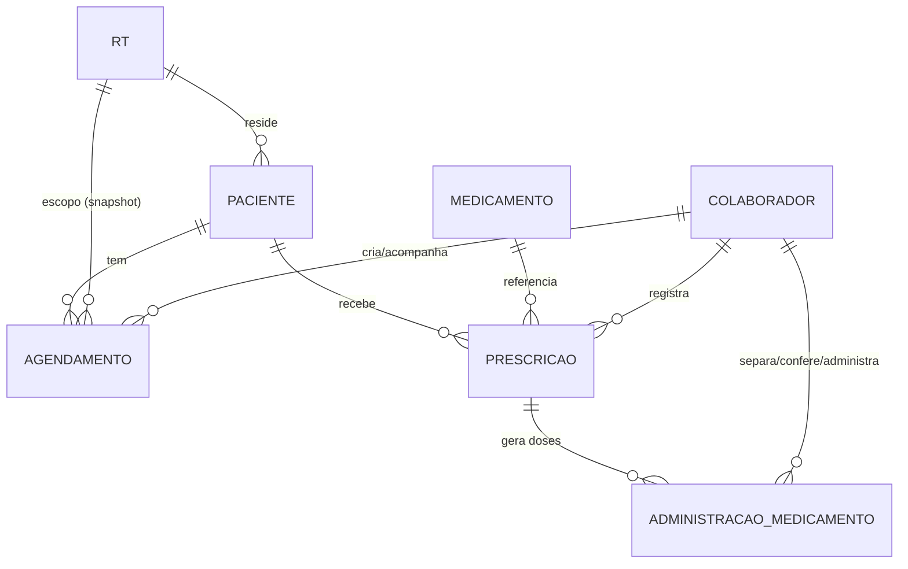

# Modelo de cuidados — pacientes, agendamentos e medicamentos

- **ID:** DOM-005
- **Status:** RASCUNHO
- **Pré-requisitos:** `00-fundacao/visao-geral-pacientes.md`, `00-fundacao/glossario.md`
- **Entregáveis:** nenhum (documento de contexto de domínio)

## Glossário do módulo

| Termo | Definição |
|---|---|
| **Paciente** | Residente de uma RT sob cuidado. Cadastrado pelo admin, lotado em exatamente uma RT. |
| **Agendamento** | Compromisso do paciente fora da rotina: consulta ou saída. Tem início e fim. |
| **Consulta** | Agendamento do tipo atendimento de saúde (médico, dentista, exame, terapia). |
| **Saída** | Agendamento do tipo passeio/atividade fora da unidade, sem finalidade clínica. |
| **Acompanhante** | Colaborador designado para ir junto no agendamento. Opcional até a confirmação. |
| **Medicamento** | Item de catálogo de referência (nome, princípio ativo). Não é específico de um paciente. |
| **Prescrição** | Receita registrada por um colaborador (ou admin) para um paciente: dose, via, horários, vigência. |
| **Definitiva** | Prescrição de uso contínuo, sem data de término prevista — só termina por suspensão manual. |
| **Temporária** | Prescrição com data de término definida no cadastro (ex.: antibiótico por 7 dias). |
| **Administração** | Registro de uma dose prevista (ou PRN), do início ao fim: separação, conferência e efetivação. |
| **Separação** | 1ª etapa: um colaborador separa/prepara a dose a ser dada. |
| **Conferência** | 2ª etapa: **outro** colaborador confere a dose separada contra a prescrição. |
| **Checagem dupla** | O par separação + conferência, feito por duas pessoas distintas — é o controle de segurança central deste módulo. |
| **PRN** | *Pro re nata* — medicamento "se necessário", sem horário fixo, registrado sob demanda; passa pela mesma checagem dupla. |
| **MAR** | Medication Administration Record — a lista de administrações de um paciente, com as três etapas visíveis, é o que a tela de medicação mostra. |

## Entidades



### Paciente

Pertence a uma RT (`rt_id`). Não existe paciente sem RT. Transferência entre unidades é uma
`UPDATE` de `rt_id` pelo admin (sem tabela de histórico dedicada — o `audit_log` já registra o
antes/depois, `SEC-AUD`; ver `RNP-02`). Agendamentos **já criados** mantêm a RT em que nasceram
(campo `rt_id` do agendamento é snapshot, não segue o paciente — `RNP-03`).

Status: `ATIVO` | `INATIVO` (alta/desligamento — soft, nunca `DELETE`, mesmo racional de
`marcacao`/`escala_dia` em `SEC-CONF`).

### Agendamento

`tipo`: `CONSULTA` | `SAIDA`. Um único modelo de tabela para as duas — elas compartilham todo o
ciclo de vida (agendar → confirmar → realizar/cancelar/não comparecer) e a mesma tela de
calendário; distingui-las em tabelas separadas duplicaria regra sem ganho (nenhum campo é
exclusivo de um tipo além de rótulo).

Campos principais: `paciente_id`, `rt_id` (snapshot), `tipo`, `titulo` (ex.: "Cardiologia",
"Passeio ao parque"), `local`, `inicio_em`/`fim_em` (`timestamptz`), `acompanhante_colaborador_id`
(opcional), `status`, `observacoes`.

Status: `AGENDADO` → `CONFIRMADO` (opcional) → `REALIZADO` | `NAO_COMPARECEU` | `CANCELADO`.

### Medicamento / Prescrição / Administração

Três tabelas, não duas, porque respondem perguntas diferentes:

- **`medicamento`** — catálogo de referência (nome, princípio ativo). Não pertence a um
  paciente; existe para autocompletar e evitar nome livre divergente (`Dipirona` vs `dipirona`).
- **`prescricao`** — a receita: *este* paciente toma *este* medicamento, nesta dose, nestes
  horários, entre estas datas. Registrada por **qualquer colaborador da RT do paciente**
  (`RNP-13`) a partir da ordem médica recebida — o sistema não integra com prontuário externo
  nesta versão, então quem lança é quem está de plantão quando a receita chega. É o que define
  quais doses **deveriam** existir.
- **`administracao_medicamento`** — o fato, do início ao fim: uma linha por dose prevista (ou
  PRN), que acumula os registros de separação, conferência e desfecho. É o histórico, e cada
  etapa nele **nunca é editada a posteriori** — correção é etapa nova, com nota (`RNP-14`).

`prescricao.tipo` (frequência): `REGULAR` (horários fixos, ex.: `08:00,14:00,20:00`) ou `PRN`
(sem horário — sob demanda). `prescricao.duracao` (vigência): `DEFINITIVA` (uso contínuo, sem
data de término) ou `TEMPORARIA` (`data_fim` obrigatória). As duas dimensões são independentes:
um antibiótico é `REGULAR` + `TEMPORARIA`; um controlado de uso contínuo é `REGULAR` +
`DEFINITIVA`; um analgésico de resgate é `PRN` + qualquer duração.

Uma prescrição `REGULAR` ativa **gera** as administrações esperadas (uma linha por horário
previsto, `status = PENDENTE`) — é o que a tela de MAR e o alerta de atraso consultam
(`FN-014`). Uma prescrição `PRN` não gera nada de antemão; a administração nasce quando um
colaborador inicia a separação de uma dose ad-hoc.

### O ciclo de uma dose — checagem dupla

Toda dose, `REGULAR` ou `PRN`, percorre três etapas, sempre nesta ordem, registradas na mesma
linha de `administracao_medicamento`:

```
PENDENTE ──separar──▶ SEPARADO ──conferir──▶ CONFERIDO ──administrar──▶ ADMINISTRADO | RECUSADO
                            │                     │
                            └──── divergência ─────┘──▶ DIVERGENTE ──nova separação──▶ SEPARADO
```

1. **Separação** — um colaborador (`separado_por_id`) registra que preparou a dose. Vira
   `SEPARADO`.
2. **Conferência** — **outro** colaborador (`conferido_por_id ≠ separado_por_id`, `RNP-26`)
   confere contra a prescrição. Se bate, vira `CONFERIDO`. Se não bate, vira `DIVERGENTE` com
   observação obrigatória explicando o quê — a dose separada é descartada e uma nova separação
   começa (histórico da tentativa divergente permanece, não é apagado, `RNP-28`).
3. **Administração** — quando `CONFERIDO`, **um dos dois** que participaram (`separado_por_id`
   ou `conferido_por_id`, nunca um terceiro colaborador que não checou a dose, `RNP-27`) dá a
   dose ao paciente ou registra recusa do paciente. Vira `ADMINISTRADO`/`RECUSADO`.

Por que uma linha só, não três tabelas: as três etapas são a mesma dose, percorrendo um estado —
nunca existe "conferência" sem "separação" correspondente, e separar três tabelas obrigaria join
toda vez que se quisesse saber o estado atual de uma dose. O preço é que `administracao_medicamento`
acumula colunas de três atores/horários — aceitável porque cada grupo de colunas só é preenchido
uma vez, na sua etapa, e nunca reescrito depois (append de fato, não de tabela).

## Por que RT é snapshot no agendamento

Se o paciente é transferido de RT1 para RT2, os agendamentos passados continuam pertencendo à
RT1 nos relatórios (quem estava de plantão levou o paciente àquela consulta, na RT1). Copiar
`rt_id` na criação e nunca mais tocar é o mesmo racional de `marcacao.cruzada`
(`03-banco/modelo-dados.md`, "campos desnormalizados"): consistência histórica sobre elegância
de join.

## Testes de aceitação

| # | Teste | Esperado |
|---|---|---|
| D5-1 | Criar agendamento para paciente da RT1 | `agendamento.rt_id = RT1` |
| D5-2 | Transferir paciente para RT2, reler agendamento antigo | `rt_id` continua RT1 |
| D5-3 | Prescrição `REGULAR` com 3 horários/dia, vigência de 7 dias (`TEMPORARIA`) | 21 administrações `PENDENTE` geradas |
| D5-4 | Prescrição `PRN` | zero administrações geradas antes da primeira separação |
| D5-5 | Prescrição `DEFINITIVA` | `data_fim` nulo, geração de doses futuras contínua até suspensão |
| D5-6 | Separar com colaborador X, conferir com colaborador X | rejeitado (`RNP-26`) |
| D5-7 | Separar com X, conferir com Y, administrar com Z | rejeitado (`RNP-27`) |
| D5-8 | Separar com X, conferir com Y, administrar com X ou Y | aceito |
| D5-9 | Conferência com divergência | dose vira `DIVERGENTE`, nova linha de separação criada, linha divergente preservada |
