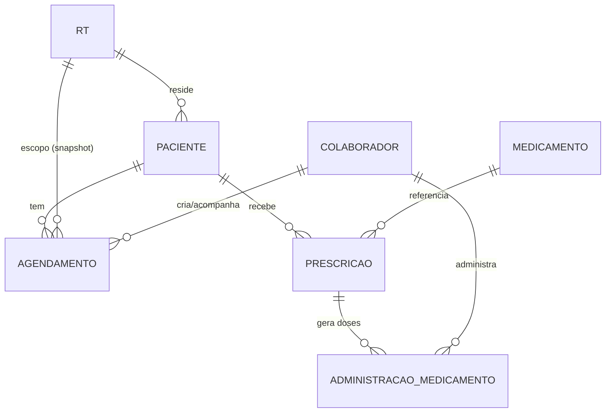

# Modelo de cuidados — pacientes, agendamentos e medicamentos

- **ID:** DOM-005
- **Status:** RASCUNHO
- **Pré-requisitos:** `00-fundacao/visao-geral-pacientes.md`, `00-fundacao/glossario.md`
- **Entregáveis:** nenhum (documento de contexto de domínio)

## Glossário do módulo

| Termo | Definição |
|---|---|
| **Paciente** | Residente de uma RT sob cuidado. Cadastrado pelo admin, lotado em exatamente uma RT. |
| **Agendamento** | Compromisso do paciente fora da rotina: consulta ou saída. Tem início e fim. |
| **Consulta** | Agendamento do tipo atendimento de saúde (médico, dentista, exame, terapia). |
| **Saída** | Agendamento do tipo passeio/atividade fora da unidade, sem finalidade clínica. |
| **Acompanhante** | Colaborador designado para ir junto no agendamento. Opcional até a confirmação. |
| **Medicamento** | Item de catálogo de referência (nome, princípio ativo). Não é específico de um paciente. |
| **Prescrição** | Ordem de uso de um medicamento para um paciente: dose, via, horários, vigência. |
| **Administração** | Registro de que uma dose prevista pela prescrição foi (ou não) dada, por quem e quando. |
| **PRN** | *Pro re nata* — medicamento "se necessário", sem horário fixo, registrado sob demanda. |
| **MAR** | Medication Administration Record — a lista de administrações de um paciente, é o que a tela de medicação mostra. |

## Entidades

### Paciente

Pertence a uma RT (`rt_id`). Não existe paciente sem RT. Transferência entre unidades é uma
`UPDATE` de `rt_id` pelo admin (sem tabela de histórico dedicada — o `audit_log` já registra o
antes/depois, `SEC-AUD`; ver `RNP-02`). Agendamentos **já criados** mantêm a RT em que nasceram
(campo `rt_id` do agendamento é snapshot, não segue o paciente — `RNP-03`).

Status: `ATIVO` | `INATIVO` (alta/desligamento — soft, nunca `DELETE`, mesmo racional de
`marcacao`/`escala_dia` em `SEC-CONF`).

### Agendamento

`tipo`: `CONSULTA` | `SAIDA`. Um único modelo de tabela para as duas — elas compartilham todo o
ciclo de vida (agendar → confirmar → realizar/cancelar/não comparecer) e a mesma tela de
calendário; distingui-las em tabelas separadas duplicaria regra sem ganho (nenhum campo é
exclusivo de um tipo além de rótulo).

Campos principais: `paciente_id`, `rt_id` (snapshot), `tipo`, `titulo` (ex.: "Cardiologia",
"Passeio ao parque"), `local`, `inicio_em`/`fim_em` (`timestamptz`), `acompanhante_colaborador_id`
(opcional), `status`, `observacoes`.

Status: `AGENDADO` → `CONFIRMADO` (opcional) → `REALIZADO` | `NAO_COMPARECEU` | `CANCELADO`.

### Medicamento / Prescrição / Administração

Três tabelas, não duas, porque respondem perguntas diferentes:

- **`medicamento`** — catálogo de referência (nome, princípio ativo). Não pertence a um
  paciente; existe para autocompletar e evitar nome livre divergente (`Dipirona` vs `dipirona`).
- **`prescricao`** — a ordem médica: *este* paciente toma *este* medicamento, nesta dose, nestes
  horários, entre estas datas. É o que define quais doses **deveriam** existir.
- **`administracao_medicamento`** — o fato: a dose prevista foi dada, recusada ou perdida, por
  quem, quando de verdade. É o histórico, nunca se edita a posteriori (`RNP-14`).

Prescrição tem `tipo`: `REGULAR` (horários fixos, ex.: `08:00,14:00,20:00`) ou `PRN` (sem
horário — administração é sempre sob demanda, com justificativa obrigatória).

Uma prescrição `REGULAR` ativa **gera** as administrações esperadas (uma linha por horário
previsto, `status = PENDENTE`) — é o que a tela de MAR e o alerta de atraso consultam
(`FN-014`). Uma prescrição `PRN` não gera nada de antemão; a administração nasce diretamente com
`status = ADMINISTRADO` ou `RECUSADO` no momento do registro.

## Por que RT é snapshot no agendamento

Se o paciente é transferido de RT1 para RT2, os agendamentos passados continuam pertencendo à
RT1 nos relatórios (quem estava de plantão levou o paciente àquela consulta, na RT1). Copiar
`rt_id` na criação e nunca mais tocar é o mesmo racional de `marcacao.cruzada`
(`03-banco/modelo-dados.md`, "campos desnormalizados"): consistência histórica sobre elegância
de join.

## Testes de aceitação

| # | Teste | Esperado |
|---|---|---|
| D5-1 | Criar agendamento para paciente da RT1 | `agendamento.rt_id = RT1` |
| D5-2 | Transferir paciente para RT2, reler agendamento antigo | `rt_id` continua RT1 |
| D5-3 | Prescrição `REGULAR` com 3 horários/dia, vigência de 7 dias | 21 administrações `PENDENTE` geradas |
| D5-4 | Prescrição `PRN` | zero administrações geradas antes do primeiro registro |
