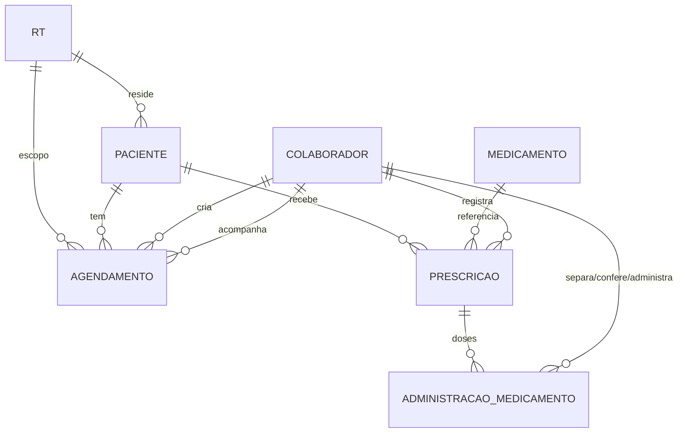

# Modelo de dados — pacientes

- **ID:** DB-006
- **Status:** RASCUNHO
- **Pré-requisitos:** `01-dominio/pacientes-modelo.md`, `03-banco/modelo-dados.md`
- **Entregáveis:** adições em `prisma/schema.prisma`, migration `NNN_pacientes`

## Diagrama



## Tabelas

| Tabela | Papel | Volume estimado/ano |
|---|---|---|
| `paciente` | Residentes das RTs | ~40 |
| `agendamento` | Consultas e saídas | ~2.000 |
| `medicamento` | Catálogo de referência | ~150 |
| `prescricao` | Ordens de uso por paciente | ~300 |
| `administracao_medicamento` | Doses previstas/registradas (MAR) | ~40.000 |

## Enums novos

```
enum TipoAgendamento { CONSULTA, SAIDA }
enum StatusAgendamento { AGENDADO, CONFIRMADO, REALIZADO, CANCELADO, NAO_COMPARECEU }
enum OrigemAgendamento { COLABORADOR, ADMIN }          -- mesmo racional de OrigemMarcacao
enum StatusPaciente { ATIVO, INATIVO }
enum TipoPrescricao { REGULAR, PRN }                   -- frequência
enum DuracaoPrescricao { DEFINITIVA, TEMPORARIA }      -- vigência — RNP-24
enum OrigemPrescricao { COLABORADOR, ADMIN }
enum StatusPrescricao { ATIVA, SUSPENSA, ENCERRADA }
enum StatusAdministracao {
  PENDENTE, SEPARADO, CONFERIDO, DIVERGENTE, ADMINISTRADO, RECUSADO, NAO_ADMINISTRADO
}
```

`StatusAdministracao` não é mais um estado plano — é a checagem dupla (`RNP-25`):
`PENDENTE → SEPARADO → CONFERIDO → (ADMINISTRADO | RECUSADO)`, com desvio `SEPARADO/CONFERIDO →
DIVERGENTE` quando a conferência acusa problema (volta para uma nova linha `PENDENTE`/`SEPARADO`,
não reaproveita a linha divergente — `RNP-28`). `ATRASADO` não é um valor de status: é rótulo
calculado por `FN-014` em cima de `PENDENTE`/`SEPARADO` vencidos, nunca gravado (`RNP-18`).

## Campos por tabela (resumo — schema completo na migration)

### `paciente`
`id uuid pk`, `rt_id uuid fk→rt (restrict)`, `nome`, `data_nascimento date`, `cpf text?`,
`nome_responsavel text?`, `contato_responsavel text?`, `observacoes_clinicas text?` (restrito,
`SEC-SAUDE`), `status StatusPaciente default ATIVO`, `criado_por_id text?` (uuid `auth.users`,
sem FK — mesmo padrão de `troca_escala.criado_por_id`), `criado_em`, `atualizado_em` (trigger
`tocar_atualizado_em`, `DB-003`).

### `agendamento`
`id uuid pk`, `paciente_id uuid fk→paciente (restrict)`, `rt_id uuid fk→rt (restrict)` —
snapshot, ver `RNP-03`, `tipo TipoAgendamento`, `titulo text`, `local text?`, `inicio_em
timestamptz`, `fim_em timestamptz`, `acompanhante_colaborador_id uuid? fk→colaborador (set
null)`, `origem OrigemAgendamento`, `criado_por_colaborador_id uuid? fk→colaborador (set null)`,
`criado_por_admin_id text?` (uuid `auth.users`, sem FK), `status StatusAgendamento default
AGENDADO`, `observacoes text?`, `motivo_cancelamento text?`, `cancelado_em timestamptz?`,
`criado_em`, `atualizado_em`.

### `medicamento`
`id uuid pk`, `nome text`, `principio_ativo text?`, `ativo boolean default true`, `criado_em`.
Tabela de referência — mesmo racional de `codigo_escala` (`DOM-003`): cadastro simples, sem
deploy para adicionar item.

### `prescricao`
`id uuid pk`, `paciente_id uuid fk→paciente (restrict)`, `medicamento_id uuid fk→medicamento
(restrict)`, `tipo TipoPrescricao` (frequência), `duracao DuracaoPrescricao` (vigência,
`RNP-24`), `dose text`, `via text` (oral, IM, tópica…), `horarios text[]` (ex.:
`['08:00','14:00','20:00']`; vazio quando `tipo = PRN`), `data_inicio date`, `data_fim date?`
(obrigatório quando `duracao = TEMPORARIA`; nulo quando `DEFINITIVA`), `prescrito_por text`
(nome do médico — texto livre, não é usuário do sistema), `instrucoes text?` (restrito,
`SEC-SAUDE`), `status StatusPrescricao default ATIVA`, `origem OrigemPrescricao`,
`criado_por_colaborador_id uuid? fk→colaborador (set null)`, `criado_por_admin_id text?`
(`auth.users`, sem FK — preenchido só quando `origem = ADMIN`), `criado_em`, `atualizado_em`.

### `administracao_medicamento`
`id uuid pk`, `prescricao_id uuid fk→prescricao (restrict)`, `horario_previsto timestamptz?`
(nulo para `PRN`), `status StatusAdministracao default PENDENTE`.

Uma coluna por etapa da checagem dupla (`RNP-30`), preenchida uma vez, nunca reescrita:

- `separado_por_id uuid? fk→colaborador (set null)`, `separado_em timestamptz?`
- `conferido_por_id uuid? fk→colaborador (set null)`, `conferido_em timestamptz?`
- `administrado_por_id uuid? fk→colaborador (set null)`, `administrado_em timestamptz?`
- `observacao text?` (obrigatório quando `PRN`, `RECUSADO` ou `DIVERGENTE`, `RNP-17`)
- `criado_em`

`administrado_por_id` guarda quem efetivamente deu a dose — que precisa ser `separado_por_id`
**ou** `conferido_por_id` (`RNP-27`, aplicado por constraint, `DB-007`).

## Campos desnormalizados (e por quê)

| Campo | Motivo | Mitigação |
|---|---|---|
| `agendamento.rt_id` | Isolar por RT sem join até `paciente` em toda query de agenda/calendário | trigger na criação, nunca atualizado depois (`RNP-03`) |

## Chaves e cascatas

| Relação | `ON DELETE` | Motivo |
|---|---|---|
| `agendamento` → `paciente` | `RESTRICT` | histórico de agenda não se perde; paciente se inativa, não se apaga |
| `agendamento` → `rt` | `RESTRICT` | idem `plantao` → `rt` |
| `agendamento` → `colaborador` (criador/acompanhante) | `SET NULL` | colaborador pode ser desligado; agendamento permanece |
| `prescricao` → `paciente` | `RESTRICT` | histórico clínico não se perde |
| `prescricao` → `medicamento` | `RESTRICT` | item de catálogo em uso não se apaga |
| `prescricao` → `colaborador` (criador) | `SET NULL` | mesmo racional de `agendamento` |
| `administracao_medicamento` → `prescricao` | `RESTRICT` | MAR é o registro legal, nunca cai em cascata |
| `administracao_medicamento` → `colaborador` (separação/conferência/administração, 3 FKs) | `SET NULL` | colaborador pode ser desligado; o registro de quem fez cada etapa permanece pelo nome histórico auditado, não pela FK |

## Testes de aceitação

| # | Teste | Esperado |
|---|---|---|
| M6-1 | `prisma migrate diff` contra o schema | vazio |
| M6-2 | Toda FK nova tem `ON DELETE` explícito | sim |
| M6-3 | Toda tabela nova tem PK `uuid` e RLS habilitada (`SEC-SAUDE`) | sim |
| M6-4 | Nenhuma coluna `timestamp` sem timezone | sim |
