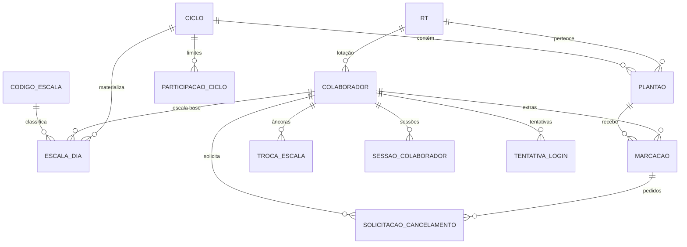

# Modelo de dados

- **ID:** DB-001
- **Status:** PRONTA
- **Entregáveis:** `prisma/schema.prisma`

## Diagrama

## Tabelas

| Tabela | Papel | Volume estimado/ano |
|---|---|---|
| `rt` | Unidades | 2 |
| `colaborador` | Pessoas | ~80 |
| `troca_escala` | Histórico de âncora | ~30 |
| `codigo_escala` | D, F, FT, FE + extensões | ~10 |
| `ciclo` | Competência mensal | 12 |
| `escala_dia` | Escala base materializada | ~15.000 |
| `plantao` | Vagas ofertadas | ~1.500 |
| `marcacao` | Extras marcadas | ~3.000 |
| `participacao_ciclo` | Overrides por colaborador | ~960 |
| `sessao_colaborador` | Sessões | ~20.000 |
| `tentativa_login` | Tentativas (expurgo 90d) | ~25.000 |
| `audit_log` | Trilha (retenção 5a) | ~60.000 |
| `solicitacao_cancelamento` | Pedido de cancelamento de extra pelo colaborador, aprovação de qualquer admin | ~300 |
| `google_calendar_conta` | Integração Google Calendar por colaborador (`API-COL-008`) | ~80 |

Volume pequeno. As decisões de modelagem priorizam **correção e auditabilidade**, não escala.

## Campos desnormalizados (e por quê)

| Campo | Motivo | Risco | Mitigação |
|---|---|---|---|
| `plantao.vagas_ocupadas` | Realtime sem expor `marcacao` | dessincroniza | job de reconciliação, `SEC-ACID` |
| `plantao.inicio_em` / `fim_em` | Comparação de intervalo indexável | divergir da data/hora | trigger, nunca a aplicação |
| `marcacao.inicio_em` / `fim_em` | Exclusion constraint (não aceita subquery) | divergir do plantão | trigger + propagação em `API-ADM-PLA-003` |
| `marcacao.cruzada` | Relatório sem join duplo | — | calculado na inserção |

## Chaves e cascatas

| Relação | `ON DELETE` | Motivo |
|---|---|---|
| `escala_dia` → `ciclo` | `CASCADE` | ciclo em rascunho pode ser descartado |
| `escala_dia` → `colaborador` | `CASCADE` | remoção física só em erro de cadastro |
| `plantao` → `ciclo` | `CASCADE` | idem |
| `marcacao` → `plantao` | `CASCADE` | com trava de aplicação (`RN-26`) |
| `marcacao` → `colaborador` | `RESTRICT` | histórico não se perde |
| `tentativa_login` → `colaborador` | `SET NULL` | tentativa pode ser de matrícula inexistente |
| `escala_dia` → `codigo_escala` | `RESTRICT` | código em uso não se apaga (`DOM-003.5`) |
| `solicitacao_cancelamento` → `marcacao` | `CASCADE` | pedido não sobrevive à marcação que o originou |
| `solicitacao_cancelamento` → `colaborador` | `CASCADE` | idem, histórico do pedido some com o colaborador |

O schema Prisma completo está em `prisma/schema.prisma` (não há markdown espelho separado).

## Testes de aceitação

| # | Teste | Esperado |
|---|---|---|
| M1 | `prisma migrate diff` contra o schema | vazio |
| M2 | Toda FK tem `ON DELETE` explícito | sim |
| M3 | Toda tabela tem PK `uuid` | sim |
| M4 | Nenhuma coluna `timestamp` sem timezone | sim |
