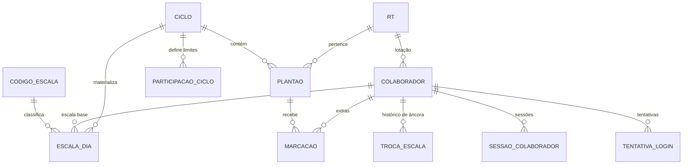

# Documento base (histórico)

- **ID:** FUND-000
- **Status:** OBSOLETA — substituído pelas specs desta pasta
- **Nota:** documento monolítico original, mantido para rastreabilidade das decisões.
  Em caso de divergência, **as specs individuais prevalecem**.

---

# Sistema de Controle de Escala e Horas Extras

## 1. Descrição

Aplicação web para gestão da **escala mensal** e dos **plantões extras** em duas unidades (RT1 e RT2).

O sistema tem dois eixos:

**Escala base.** Cada colaborador tem um turno padrão (diurno 07–19 ou noturno 19–07) em regime 12x36. O sistema calcula automaticamente quais dias ele trabalha em cada mês, marca ausências (F, FT, FE) e gera a escala mensal para impressão.

**Extras.** A administração abre um ciclo mensal, publica os plantões disponíveis e define quantas extras cada colaborador pode pegar. Os colaboradores marcam os plantões desejados, com vagas atualizadas em tempo real.

As duas coisas conversam: a escala base define quando o colaborador já está ocupado, e o sistema usa isso para **bloquear extras que violariam o descanso** ou que cairiam em cima do próprio plantão.

---

## 2. Stack

| Camada | Tecnologia |
|---|---|
| Framework | Next.js 15 (App Router, Server Actions + Route Handlers) |
| Linguagem | TypeScript |
| Banco | PostgreSQL (Supabase) |
| ORM | Prisma (`DATABASE_URL` via pooler + `DIRECT_URL` para migrations) |
| Realtime | Supabase Realtime (Postgres Changes em `plantao` + Broadcast para marcações) |
| Auth admin | Supabase Auth (e-mail/senha) |
| Auth colaborador | Matrícula + CPF + PIN, sessão própria em cookie `httpOnly` |
| Rate limit | Upstash Redis (ou tabela `tentativa_login` com janela deslizante) |
| Validação | Zod |
| UI | Tailwind + shadcn/ui |
| Impressão | Página com CSS `@media print` (A4 paisagem) + export PDF |
| Datas | date-fns-tz, fuso fixo `America/Sao_Paulo` |
| Deploy | Vercel |

---

## 3. Cálculo da escala 12x36

### 3.1 O problema da paridade

O colaborador trabalha em dias alternados. Em agosto ele pegou os ímpares; como agosto tem 31 dias, o dia 31 (ímpar) é seguido pelo dia 2 de setembro — e ele passa a trabalhar os **pares**. A paridade vira toda vez que o mês tem número ímpar de dias (jan, mar, mai, jul, ago, out, dez) e nunca vira nos de 30 dias.

Por isso, **não se armazena "par" ou "ímpar"**. Isso é consequência, não configuração. O que se armazena é uma **data âncora** — um dia em que o colaborador comprovadamente trabalhou — e a periodicidade em dias.

```
trabalha(D) ⟺ (D − ancora) mod periodo == 0
```

Com `ancora = 2025-08-01` e `periodo = 2`:
- Agosto: 1, 3, 5, … 31 (ímpares)
- Setembro: 2, 4, 6, … 30 (pares) ← a virada acontece sozinha
- Outubro: 2, 4, … 30 (pares)
- Novembro: 1, 3, … 29 (ímpares)

A âncora nunca muda salvo decisão administrativa (troca de escala, retorno de licença longa). Uma troca é registrada com nova âncora e data de vigência.

### 3.2 Validação do descanso

Regime 12x36 real: turno noturno de 19h D até 07h D+1, próximo turno às 19h de D+2 → 36h de descanso. O mesmo vale para o diurno. A alternância de dias produz o 12x36 exato, o que confirma `periodo = 2`.

### 3.3 Blocos de 12 horas

Todo compromisso — plantão base ou extra — vira um intervalo:

| Turno | Início | Fim |
|---|---|---|
| DIURNO em D | `D 07:00` | `D 19:00` |
| NOTURNO em D | `D 19:00` | `D+1 07:00` |

Dois blocos são **contíguos** quando o fim de um é exatamente o início do outro. Toda a regra de descanso se reduz a: *nenhuma sequência contígua pode ter mais de 2 blocos* (24h máximo).

```
D2 diurno  [07–19]  +  D2 noturno [19–07]              → 24h, permitido
D2 noturno [19–07]  +  D3 diurno  [07–19]              → 24h, permitido
D2 diurno  + D2 noturno + D3 diurno                    → 36h, BLOQUEADO
```

Para isso, `plantao` e `escala_dia` guardam `inicio_em` e `fim_em` como `timestamptz`, preenchidos por trigger. A verificação vira uma consulta de intervalos, sem aritmética de calendário espalhada pelo código.

---

## 4. Modelo de dados

### 4.1 Diagrama



### 4.2 Schema Prisma

```prisma
generator client {
  provider = "prisma-client-js"
}

datasource db {
  provider  = "postgresql"
  url       = env("DATABASE_URL")
  directUrl = env("DIRECT_URL")
}

enum TipoPlantao {
  DIURNO
  NOTURNO
}

enum StatusCiclo {
  RASCUNHO
  PUBLICADO
  FECHADO
}

enum StatusMarcacao {
  CONFIRMADA
  CANCELADA
}

enum OrigemMarcacao {
  COLABORADOR
  ADMIN
}

model Rt {
  id            String        @id @default(uuid()) @db.Uuid
  codigo        String        @unique                 // "RT1" | "RT2"
  nome          String
  ativo         Boolean       @default(true)
  criadoEm      DateTime      @default(now()) @map("criado_em")

  colaboradores Colaborador[]
  plantoes      Plantao[]

  @@map("rt")
}

model Colaborador {
  id               String       @id @default(uuid()) @db.Uuid
  matricula        String       @unique
  nome             String
  rtId             String       @map("rt_id") @db.Uuid

  // ---- credenciais ----
  cpfHash          String       @map("cpf_hash")             // argon2id + pepper
  cpfUltimos4      String       @map("cpf_ultimos4") @db.Char(4)
  pinHash          String?      @map("pin_hash")             // argon2id
  pinDefinidoEm    DateTime?    @map("pin_definido_em")
  precisaTrocarPin Boolean      @default(true) @map("precisa_trocar_pin")
  tentativasFalhas Int          @default(0) @map("tentativas_falhas")
  bloqueadoAte     DateTime?    @map("bloqueado_ate")

  // ---- escala base ----
  turnoPadrao      TipoPlantao? @map("turno_padrao")
  escalaAncora     DateTime?    @map("escala_ancora") @db.Date  // um dia trabalhado
  escalaPeriodo    Int          @default(2) @map("escala_periodo")
  escalaHoraInicio String       @default("07:00") @map("escala_hora_inicio")
  escalaHoraFim    String       @default("19:00") @map("escala_hora_fim")

  ativo            Boolean      @default(true)
  criadoEm         DateTime     @default(now()) @map("criado_em")
  atualizadoEm     DateTime     @updatedAt @map("atualizado_em")

  rt               Rt                  @relation(fields: [rtId], references: [id])
  marcacoes        Marcacao[]
  escalaDias       EscalaDia[]
  participacoes    ParticipacaoCiclo[]
  sessoes          SessaoColaborador[]
  trocasEscala     TrocaEscala[]

  @@index([rtId, ativo])
  @@map("colaborador")
}

model TrocaEscala {
  id             String       @id @default(uuid()) @db.Uuid
  colaboradorId  String       @map("colaborador_id") @db.Uuid
  vigenciaInicio DateTime     @map("vigencia_inicio") @db.Date
  turno          TipoPlantao
  ancora         DateTime     @db.Date
  periodo        Int          @default(2)
  motivo         String?
  criadoPor      String?      @map("criado_por")
  criadoEm       DateTime     @default(now()) @map("criado_em")

  colaborador    Colaborador  @relation(fields: [colaboradorId], references: [id], onDelete: Cascade)

  @@index([colaboradorId, vigenciaInicio])
  @@map("troca_escala")
}

/// Códigos impressos na escala: D, F, FT, FE (extensível pelo admin)
model CodigoEscala {
  codigo        String      @id                    // "D" | "F" | "FT" | "FE"
  descricao     String
  presenca      Boolean     @default(false)        // true = trabalha o plantão
  ocupaHorario  Boolean     @default(false) @map("ocupa_horario") // conta p/ descanso
  remunerada    Boolean     @default(true)
  cor           String?                            // badge na impressão
  ordem         Int         @default(0)
  ativo         Boolean     @default(true)

  escalaDias    EscalaDia[]

  @@map("codigo_escala")
}

/// Um dia da escala base de um colaborador. Materializado por ciclo.
model EscalaDia {
  id             String       @id @default(uuid()) @db.Uuid
  cicloId        String       @map("ciclo_id") @db.Uuid
  colaboradorId  String       @map("colaborador_id") @db.Uuid
  data           DateTime     @db.Date
  turno          TipoPlantao
  codigo         String       @default("D")
  horaInicio     String       @map("hora_inicio")
  horaFim        String       @map("hora_fim")
  inicioEm       DateTime     @map("inicio_em") @db.Timestamptz  // trigger
  fimEm          DateTime     @map("fim_em") @db.Timestamptz     // trigger
  observacao     String?
  criadoEm       DateTime     @default(now()) @map("criado_em")
  atualizadoEm   DateTime     @updatedAt @map("atualizado_em")

  ciclo          Ciclo        @relation(fields: [cicloId], references: [id], onDelete: Cascade)
  colaborador    Colaborador  @relation(fields: [colaboradorId], references: [id], onDelete: Cascade)
  codigoEscala   CodigoEscala @relation(fields: [codigo], references: [codigo])

  @@unique([colaboradorId, data])
  @@index([cicloId, data])
  @@map("escala_dia")
}

model Ciclo {
  id                  String      @id @default(uuid()) @db.Uuid
  ano                 Int
  mes                 Int
  limitePadrao        Int         @map("limite_padrao")
  permiteCruzada      Boolean     @default(false) @map("permite_cruzada")
  permiteExtraEmFolga Boolean     @default(false) @map("permite_extra_em_folga")
  maxBlocosSeguidos   Int         @default(2) @map("max_blocos_seguidos")
  aberturaMarcacao    DateTime?   @map("abertura_marcacao")
  fechamentoMarcacao  DateTime?   @map("fechamento_marcacao")
  escalaGeradaEm      DateTime?   @map("escala_gerada_em")
  status              StatusCiclo @default(RASCUNHO)
  criadoEm            DateTime    @default(now()) @map("criado_em")
  atualizadoEm        DateTime    @updatedAt @map("atualizado_em")

  plantoes            Plantao[]
  escalaDias          EscalaDia[]
  participacoes       ParticipacaoCiclo[]

  @@unique([ano, mes])
  @@map("ciclo")
}

model Plantao {
  id             String      @id @default(uuid()) @db.Uuid
  cicloId        String      @map("ciclo_id") @db.Uuid
  rtId           String      @map("rt_id") @db.Uuid
  data           DateTime    @db.Date
  tipo           TipoPlantao
  horaInicio     String      @default("07:00") @map("hora_inicio")
  horaFim        String      @default("19:00") @map("hora_fim")
  inicioEm       DateTime    @map("inicio_em") @db.Timestamptz   // trigger
  fimEm          DateTime    @map("fim_em") @db.Timestamptz      // trigger
  cargaHoras     Int         @default(12) @map("carga_horas")
  vagasTotais    Int         @map("vagas_totais")
  vagasOcupadas  Int         @default(0) @map("vagas_ocupadas")
  permiteCruzada Boolean?    @map("permite_cruzada")             // null = herda do ciclo
  observacao     String?
  ativo          Boolean     @default(true)
  criadoEm       DateTime    @default(now()) @map("criado_em")

  ciclo          Ciclo       @relation(fields: [cicloId], references: [id], onDelete: Cascade)
  rt             Rt          @relation(fields: [rtId], references: [id])
  marcacoes      Marcacao[]

  @@unique([cicloId, rtId, data, tipo])
  @@index([cicloId, data])
  @@map("plantao")
}

model Marcacao {
  id            String         @id @default(uuid()) @db.Uuid
  plantaoId     String         @map("plantao_id") @db.Uuid
  colaboradorId String         @map("colaborador_id") @db.Uuid
  status        StatusMarcacao @default(CONFIRMADA)
  cruzada       Boolean        @default(false)
  origem        OrigemMarcacao @default(COLABORADOR)
  ip            String?
  userAgent     String?        @map("user_agent")
  criadoEm      DateTime       @default(now()) @map("criado_em")
  canceladoEm   DateTime?      @map("cancelado_em")
  canceladoPor  String?        @map("cancelado_por")

  plantao       Plantao        @relation(fields: [plantaoId], references: [id], onDelete: Cascade)
  colaborador   Colaborador    @relation(fields: [colaboradorId], references: [id])

  @@index([colaboradorId, status])
  @@index([plantaoId, status])
  @@map("marcacao")
}

model ParticipacaoCiclo {
  id             String   @id @default(uuid()) @db.Uuid
  cicloId        String   @map("ciclo_id") @db.Uuid
  colaboradorId  String   @map("colaborador_id") @db.Uuid
  limiteOverride Int?     @map("limite_override")
  permiteCruzada Boolean? @map("permite_cruzada")
  bloqueado      Boolean  @default(false)
  motivo         String?

  ciclo          Ciclo       @relation(fields: [cicloId], references: [id], onDelete: Cascade)
  colaborador    Colaborador @relation(fields: [colaboradorId], references: [id], onDelete: Cascade)

  @@unique([cicloId, colaboradorId])
  @@map("participacao_ciclo")
}

model SessaoColaborador {
  id            String      @id @default(uuid()) @db.Uuid
  colaboradorId String      @map("colaborador_id") @db.Uuid
  tokenHash     String      @unique @map("token_hash")
  ip            String?
  userAgent     String?     @map("user_agent")
  ultimoUsoEm   DateTime?   @map("ultimo_uso_em")
  expiraEm      DateTime    @map("expira_em")
  revogadaEm    DateTime?   @map("revogada_em")
  criadoEm      DateTime    @default(now()) @map("criado_em")

  colaborador   Colaborador @relation(fields: [colaboradorId], references: [id], onDelete: Cascade)

  @@index([colaboradorId, revogadaEm])
  @@map("sessao_colaborador")
}

model TentativaLogin {
  id            String   @id @default(uuid()) @db.Uuid
  matricula     String
  colaboradorId String?  @map("colaborador_id") @db.Uuid
  ip            String
  userAgent     String?  @map("user_agent")
  sucesso       Boolean
  motivo        String?                                  // CPF_INVALIDO, PIN_INVALIDO...
  criadoEm      DateTime @default(now()) @map("criado_em")

  colaborador   Colaborador? @relation(fields: [colaboradorId], references: [id], onDelete: SetNull)

  @@index([matricula, criadoEm])
  @@index([ip, criadoEm])
  @@map("tentativa_login")
}

model AuditLog {
  id         String   @id @default(uuid()) @db.Uuid
  atorTipo   String   @map("ator_tipo")     // ADMIN | COLABORADOR | SISTEMA
  atorId     String?  @map("ator_id")
  acao       String
  entidade   String
  entidadeId String?  @map("entidade_id")
  payload    Json?
  ip         String?
  userAgent  String?  @map("user_agent")
  criadoEm   DateTime @default(now()) @map("criado_em")

  @@index([entidade, entidadeId])
  @@index([atorId, criadoEm])
  @@map("audit_log")
}
```

### 4.3 Seed dos códigos de escala

| Código | Descrição | `presenca` | `ocupaHorario` | `remunerada` |
|---|---|---|---|---|
| `D` | Disponível — trabalha o plantão | ✅ | ✅ | ✅ |
| `F` | Folga | ❌ | ❌ | conforme regra |
| `FT` | Folga Treinamento | ❌ | ✅ | ✅ |
| `FE` | Folga TRE | ❌ | ✅ | ✅ |

A distinção entre `presenca` e `ocupaHorario` é o ponto importante:

- `presenca` responde *"ele cobre esse plantão?"* — usado na impressão da escala e na contagem de cobertura por RT.
- `ocupaHorario` responde *"ele está fisicamente comprometido nesse intervalo?"* — usado na regra de descanso. Quem está em treinamento (FT) ou no TRE (FE) **não está descansando**, então esses blocos continuam contando para o limite de 24h seguidas. Só `F` libera de fato o horário.

O admin pode cadastrar códigos novos (atestado, férias, licença) sem alterar código, definindo as duas flags.

### 4.4 Constraints e triggers (SQL)

```sql
-- Uma marcação confirmada por colaborador/plantão
CREATE UNIQUE INDEX marcacao_unica_confirmada
  ON marcacao (plantao_id, colaborador_id)
  WHERE status = 'CONFIRMADA';

ALTER TABLE plantao
  ADD CONSTRAINT chk_vagas CHECK (vagas_ocupadas BETWEEN 0 AND vagas_totais);

ALTER TABLE ciclo
  ADD CONSTRAINT chk_mes CHECK (mes BETWEEN 1 AND 12),
  ADD CONSTRAINT chk_limite CHECK (limite_padrao >= 0),
  ADD CONSTRAINT chk_blocos CHECK (max_blocos_seguidos BETWEEN 1 AND 3);

-- Preenche inicio_em / fim_em a partir de data + horários, em America/Sao_Paulo
CREATE OR REPLACE FUNCTION preencher_intervalo() RETURNS trigger
LANGUAGE plpgsql AS $$
BEGIN
  NEW.inicio_em := (NEW.data + NEW.hora_inicio::time) AT TIME ZONE 'America/Sao_Paulo';
  NEW.fim_em := CASE
    WHEN NEW.hora_fim::time <= NEW.hora_inicio::time
      THEN (NEW.data + 1 + NEW.hora_fim::time) AT TIME ZONE 'America/Sao_Paulo'
      ELSE (NEW.data + NEW.hora_fim::time) AT TIME ZONE 'America/Sao_Paulo'
  END;
  RETURN NEW;
END $$;

CREATE TRIGGER trg_plantao_intervalo BEFORE INSERT OR UPDATE ON plantao
  FOR EACH ROW EXECUTE FUNCTION preencher_intervalo();
CREATE TRIGGER trg_escala_intervalo BEFORE INSERT OR UPDATE ON escala_dia
  FOR EACH ROW EXECUTE FUNCTION preencher_intervalo();

CREATE INDEX idx_escala_intervalo ON escala_dia (colaborador_id, inicio_em, fim_em);
CREATE INDEX idx_plantao_intervalo ON plantao (inicio_em, fim_em);
```

---

## 5. Funções de negócio no banco

### 5.1 Geração da escala mensal

```sql
CREATE OR REPLACE FUNCTION gerar_escala_mensal(p_ciclo_id uuid)
RETURNS int LANGUAGE plpgsql AS $$
DECLARE
  v_ciclo   ciclo%ROWTYPE;
  v_inicio  date;
  v_fim     date;
  v_criados int := 0;
BEGIN
  SELECT * INTO v_ciclo FROM ciclo WHERE id = p_ciclo_id;
  v_inicio := make_date(v_ciclo.ano, v_ciclo.mes, 1);
  v_fim    := (v_inicio + interval '1 month - 1 day')::date;

  INSERT INTO escala_dia
    (id, ciclo_id, colaborador_id, data, turno, codigo, hora_inicio, hora_fim,
     inicio_em, fim_em)
  SELECT
    gen_random_uuid(), p_ciclo_id, c.id, d::date,
    COALESCE(t.turno, c.turno_padrao),
    'D',
    c.escala_hora_inicio, c.escala_hora_fim,
    now(), now()                                  -- sobrescritos pelo trigger
  FROM colaborador c
  CROSS JOIN generate_series(v_inicio, v_fim, interval '1 day') d
  LEFT JOIN LATERAL (
    SELECT * FROM troca_escala te
     WHERE te.colaborador_id = c.id AND te.vigencia_inicio <= d::date
     ORDER BY te.vigencia_inicio DESC LIMIT 1
  ) t ON true
  WHERE c.ativo
    AND c.escala_ancora IS NOT NULL
    AND ((d::date - COALESCE(t.ancora, c.escala_ancora))
         % COALESCE(t.periodo, c.escala_periodo) + COALESCE(t.periodo, c.escala_periodo))
         % COALESCE(t.periodo, c.escala_periodo) = 0
  ON CONFLICT (colaborador_id, data) DO NOTHING;

  GET DIAGNOSTICS v_criados = ROW_COUNT;
  UPDATE ciclo SET escala_gerada_em = now() WHERE id = p_ciclo_id;
  RETURN v_criados;
END $$;
```

`ON CONFLICT DO NOTHING` garante idempotência: regerar a escala **não apaga ausências já lançadas**.

### 5.2 Blocos ocupados de um colaborador

```sql
CREATE OR REPLACE FUNCTION blocos_ocupados(p_colaborador_id uuid, p_de timestamptz, p_ate timestamptz)
RETURNS TABLE (inicio_em timestamptz, fim_em timestamptz, origem text)
LANGUAGE sql STABLE AS $$
  -- escala base (só o que de fato ocupa o horário)
  SELECT e.inicio_em, e.fim_em, 'ESCALA'
    FROM escala_dia e
    JOIN codigo_escala ce ON ce.codigo = e.codigo
   WHERE e.colaborador_id = p_colaborador_id
     AND (ce.presenca OR ce.ocupa_horario)
     AND e.inicio_em < p_ate AND e.fim_em > p_de
  UNION ALL
  -- extras já confirmadas
  SELECT p.inicio_em, p.fim_em, 'EXTRA'
    FROM marcacao m
    JOIN plantao p ON p.id = m.plantao_id
   WHERE m.colaborador_id = p_colaborador_id
     AND m.status = 'CONFIRMADA'
     AND p.inicio_em < p_ate AND p.fim_em > p_de;
$$;
```

### 5.3 Verificação de descanso

```sql
CREATE OR REPLACE FUNCTION valida_descanso(
  p_colaborador_id uuid, p_inicio timestamptz, p_fim timestamptz, p_max_blocos int
) RETURNS text LANGUAGE plpgsql STABLE AS $$
DECLARE
  v_cursor timestamptz;
  v_antes  int := 0;
  v_depois int := 0;
BEGIN
  -- 1. sobreposição direta (inclui "mesmo dia + mesmo turno do próprio plantão")
  IF EXISTS (
    SELECT 1 FROM blocos_ocupados(p_colaborador_id, p_inicio - interval '36 h', p_fim + interval '36 h')
     WHERE inicio_em < p_fim AND fim_em > p_inicio
  ) THEN RETURN 'CONFLITO_DE_HORARIO'; END IF;

  -- 2. cadeia contígua para trás
  v_cursor := p_inicio;
  LOOP
    SELECT fim_em INTO v_cursor
      FROM blocos_ocupados(p_colaborador_id, v_cursor - interval '24 h', v_cursor)
     WHERE fim_em = v_cursor LIMIT 1;
    EXIT WHEN NOT FOUND;
    v_antes := v_antes + 1;
    SELECT inicio_em INTO v_cursor
      FROM blocos_ocupados(p_colaborador_id, v_cursor - interval '24 h', v_cursor)
     WHERE fim_em = v_cursor LIMIT 1;
  END LOOP;

  -- 3. cadeia contígua para frente
  v_cursor := p_fim;
  LOOP
    SELECT fim_em INTO v_cursor
      FROM blocos_ocupados(p_colaborador_id, v_cursor, v_cursor + interval '24 h')
     WHERE inicio_em = v_cursor LIMIT 1;
    EXIT WHEN NOT FOUND;
    v_depois := v_depois + 1;
  END LOOP;

  IF v_antes + 1 + v_depois > p_max_blocos THEN
    RETURN 'EXCEDE_JORNADA';
  END IF;

  RETURN NULL;   -- liberado
END $$;
```

> A implementação acima está escrita para clareza. Na prática, carregue os blocos da janela `[início − 36h, fim + 36h]` em um array ordenado e percorra a contiguidade em memória — é uma varredura só, sem loop de queries.

### 5.4 Marcação de extra

```sql
CREATE OR REPLACE FUNCTION marcar_extra(
  p_plantao_id uuid, p_colaborador_id uuid, p_origem origem_marcacao DEFAULT 'COLABORADOR',
  p_ip text DEFAULT NULL, p_user_agent text DEFAULT NULL
) RETURNS marcacao LANGUAGE plpgsql AS $$
DECLARE
  v_plantao plantao%ROWTYPE;
  v_colab   colaborador%ROWTYPE;
  v_ciclo   ciclo%ROWTYPE;
  v_part    participacao_ciclo%ROWTYPE;
  v_escala  escala_dia%ROWTYPE;
  v_erro    text;
  v_limite  int;
  v_usadas  int;
  v_cruzada boolean;
  v_result  marcacao%ROWTYPE;
BEGIN
  SELECT * INTO v_plantao FROM plantao WHERE id = p_plantao_id FOR UPDATE;
  IF NOT FOUND OR NOT v_plantao.ativo THEN RAISE EXCEPTION 'PLANTAO_INDISPONIVEL'; END IF;

  SELECT * INTO v_ciclo FROM ciclo WHERE id = v_plantao.ciclo_id;
  IF v_ciclo.status <> 'PUBLICADO' THEN RAISE EXCEPTION 'CICLO_FECHADO'; END IF;
  IF v_ciclo.abertura_marcacao IS NOT NULL AND now() < v_ciclo.abertura_marcacao
     THEN RAISE EXCEPTION 'JANELA_NAO_ABERTA'; END IF;
  IF v_ciclo.fechamento_marcacao IS NOT NULL AND now() > v_ciclo.fechamento_marcacao
     THEN RAISE EXCEPTION 'JANELA_ENCERRADA'; END IF;

  SELECT * INTO v_colab FROM colaborador WHERE id = p_colaborador_id AND ativo;
  IF NOT FOUND THEN RAISE EXCEPTION 'COLABORADOR_INATIVO'; END IF;

  SELECT * INTO v_part FROM participacao_ciclo
   WHERE ciclo_id = v_ciclo.id AND colaborador_id = p_colaborador_id;
  IF v_part.bloqueado THEN RAISE EXCEPTION 'COLABORADOR_BLOQUEADO'; END IF;

  -- RT cruzada
  v_cruzada := v_plantao.rt_id <> v_colab.rt_id;
  IF v_cruzada AND NOT COALESCE(
       v_part.permite_cruzada, v_plantao.permite_cruzada, v_ciclo.permite_cruzada, false)
     THEN RAISE EXCEPTION 'CRUZADA_BLOQUEADA'; END IF;

  -- Extra em cima do próprio dia de folga
  SELECT * INTO v_escala FROM escala_dia
   WHERE colaborador_id = p_colaborador_id AND data = v_plantao.data;
  IF FOUND AND v_escala.codigo <> 'D' AND NOT v_ciclo.permite_extra_em_folga THEN
    RAISE EXCEPTION 'EM_AUSENCIA';
  END IF;

  -- Conflito de horário e jornada máxima
  v_erro := valida_descanso(p_colaborador_id, v_plantao.inicio_em, v_plantao.fim_em,
                            v_ciclo.max_blocos_seguidos);
  IF v_erro IS NOT NULL THEN RAISE EXCEPTION '%', v_erro; END IF;

  -- Limite do ciclo
  v_limite := COALESCE(v_part.limite_override, v_ciclo.limite_padrao);
  SELECT count(*) INTO v_usadas
    FROM marcacao m JOIN plantao p ON p.id = m.plantao_id
   WHERE m.colaborador_id = p_colaborador_id AND m.status = 'CONFIRMADA'
     AND p.ciclo_id = v_ciclo.id;
  IF v_usadas >= v_limite THEN RAISE EXCEPTION 'LIMITE_ATINGIDO'; END IF;

  -- Vagas
  IF v_plantao.vagas_ocupadas >= v_plantao.vagas_totais THEN RAISE EXCEPTION 'SEM_VAGA'; END IF;

  INSERT INTO marcacao (id, plantao_id, colaborador_id, status, cruzada, origem, ip, user_agent)
  VALUES (gen_random_uuid(), p_plantao_id, p_colaborador_id, 'CONFIRMADA', v_cruzada,
          p_origem, p_ip, p_user_agent)
  RETURNING * INTO v_result;

  UPDATE plantao SET vagas_ocupadas = vagas_ocupadas + 1 WHERE id = p_plantao_id;
  RETURN v_result;
END $$;
```

### 5.5 Listagem de extras com motivo de bloqueio

O colaborador precisa ver **por que** um plantão está indisponível, não só que está. Uma função retorna a grade já avaliada:

```sql
CREATE OR REPLACE FUNCTION plantoes_para_colaborador(p_ciclo_id uuid, p_colaborador_id uuid)
RETURNS TABLE (
  plantao_id uuid, data date, tipo tipo_plantao, rt_codigo text,
  vagas_totais int, vagas_ocupadas int,
  ja_marcado boolean, disponivel boolean, motivo text
) LANGUAGE plpgsql STABLE AS $$
-- Para cada plantão do ciclo, aplica na ordem:
--   JA_MARCADO → SEM_VAGA → CRUZADA_BLOQUEADA → EM_AUSENCIA
--   → CONFLITO_DE_HORARIO → EXCEDE_JORNADA → LIMITE_ATINGIDO
-- Retorna o primeiro motivo encontrado, ou disponivel = true.
$$;
```

A UI usa esse retorno direto: célula verde (disponível), cinza com tooltip do motivo (bloqueado), azul (já marcado). O cliente **nunca** decide sozinho — apenas reflete o veredito do servidor, e `marcar_extra` revalida tudo no momento da gravação.

---

## 6. Autenticação e segurança

### 6.1 Fluxo do colaborador

```
1. POST /api/auth/colaborador/login  { matricula, cpf }
   └─ valida matrícula + hash do CPF
   └─ se pin_hash IS NULL  → responde { precisaDefinirPin: true, tokenSetup }
   └─ se pin_hash existe   → responde { precisaPin: true, tokenParcial }

2. POST /api/auth/colaborador/pin    { tokenParcial, pin }
   └─ valida PIN → cria sessão (cookie httpOnly, SameSite=Lax, Secure)

3. POST /api/auth/colaborador/definir-pin  { tokenSetup, pin, confirmacao }
   └─ primeiro acesso: define PIN de 4–6 dígitos
```

Matrícula e CPF identificam; o **PIN autentica**. Sem ele, qualquer colega com acesso à folha de ponto marcaria plantões no lugar de outro.

### 6.2 Rate limit e bloqueio

| Escopo | Limite | Ação ao estourar |
|---|---|---|
| Por matrícula | 5 falhas / 15 min | `bloqueadoAte = now() + 15 min` |
| Por matrícula (acumulado) | 10 falhas / 24 h | bloqueio até liberação manual pelo admin |
| Por IP | 20 tentativas / 15 min | HTTP 429 |
| Por IP | 100 tentativas / 24 h | HTTP 429 + alerta no dashboard |

Toda tentativa (sucesso ou falha) vira linha em `tentativa_login` com IP, user-agent e motivo. Sucesso zera `tentativasFalhas`.

A resposta de erro é **sempre genérica** (`CREDENCIAIS_INVALIDAS`), com tempo de resposta constante, para não revelar se a matrícula existe.

### 6.3 Sessão

- Duração: **8 horas**, renovável enquanto ativa (sliding, teto de 12h).
- Cookie `httpOnly`, `Secure`, `SameSite=Lax`, assinado com `SESSION_SECRET`.
- No banco guarda-se apenas o **hash** do token (`tokenHash`).
- Middleware valida a sessão a cada request, atualiza `ultimoUsoEm` e rejeita se `revogadaEm` ou `expiraEm` já passaram.
- Admin pode revogar todas as sessões de um colaborador em um clique.
- Job diário limpa sessões expiradas há mais de 30 dias.

### 6.4 Auditoria

Toda marcação e cancelamento grava `ip` e `userAgent` — na própria linha de `marcacao` e no `audit_log`. Ações auditadas: login, definição/troca de PIN, marcar, cancelar, publicar/fechar ciclo, gerar escala, alterar ausência, alterar limite, alterar flag de cruzada, alterar âncora de escala.

### 6.5 Dados sensíveis

- CPF e PIN em **argon2id** com pepper de ambiente (`CPF_PEPPER`, `PIN_PEPPER`). O CPF em claro nunca é persistido; apenas os 4 últimos dígitos, para conferência visual do admin.
- `SUPABASE_SERVICE_ROLE_KEY` só no servidor. O cliente recebe apenas a `anon key`, usada exclusivamente para Realtime de leitura em `plantao`.

---

## 7. Regras de negócio

### Escala base

| ID | Regra |
|---|---|
| RN-01 | Todo colaborador tem turno padrão, data âncora e periodicidade (padrão 2 = 12x36). |
| RN-02 | O dia trabalhado é derivado: `(data − ancora) mod periodo == 0`. A paridade par/ímpar é consequência, nunca configuração. |
| RN-03 | Troca de escala cria registro em `troca_escala` com data de vigência; escalas passadas ficam intactas. |
| RN-04 | A escala mensal é materializada em `escala_dia` ao criar o ciclo, com código `D`. |
| RN-05 | Regerar a escala é idempotente e **não sobrescreve** ausências já lançadas. |
| RN-06 | Ausências: `F` (folga), `FT` (folga treinamento), `FE` (folga TRE), além de códigos criados pelo admin. |
| RN-07 | `presenca` define se o plantão está coberto; `ocupaHorario` define se conta para o descanso. `FT` e `FE` ocupam horário; `F` não. |
| RN-08 | Só o admin lança ou altera ausência. O colaborador visualiza. |
| RN-09 | Ausência **não** consome cota de extras — os dois controles são independentes. |
| RN-10 | Alterar ausência de um dia com extra já marcada exige confirmação e gera log. |

### Jornada e descanso

| ID | Regra |
|---|---|
| RN-11 | Cada plantão é um bloco de 12h: diurno `[D 07:00, D 19:00)`, noturno `[D 19:00, D+1 07:00)`. |
| RN-12 | Nenhuma sequência contígua pode exceder **2 blocos (24h)**. Três seguidos = 36h = bloqueado. |
| RN-13 | O colaborador **não pode** pegar extra que sobreponha o próprio plantão (mesmo dia e mesmo turno). |
| RN-14 | Pode pegar extra **imediatamente antes ou depois** do próprio plantão — 24h seguidas são permitidas. |
| RN-15 | Blocos com `ocupaHorario = true` (FT, FE) contam para a jornada mesmo sem presença. |
| RN-16 | Por padrão não se marca extra em dia com ausência lançada; a flag `permiteExtraEmFolga` do ciclo libera. |
| RN-17 | O limite de blocos é configurável por ciclo (`maxBlocosSeguidos`, padrão 2) para eventual exceção formal. |

### Extras

| ID | Regra |
|---|---|
| RN-18 | Plantões só ficam visíveis com ciclo `PUBLICADO` e dentro da janela de marcação. |
| RN-19 | Por padrão o colaborador só marca na própria RT. |
| RN-20 | Cruzada segue a precedência: `participacao_ciclo` → `plantao` → `ciclo` → `false`. |
| RN-21 | Limite = `limiteOverride` ou, se nulo, `ciclo.limitePadrao`. |
| RN-22 | Ao atingir o limite, a UI desabilita a marcação **e** o banco rejeita. |
| RN-23 | Um plantão nunca ultrapassa `vagasTotais`; a checagem é atômica (`FOR UPDATE`). |
| RN-24 | Cancelamento pelo colaborador é permitido até `fechamentoMarcacao`; depois, só o admin. |
| RN-25 | Ciclo `FECHADO` é imutável. |
| RN-26 | Reduzir `vagasTotais` abaixo de `vagasOcupadas` é bloqueado. |
| RN-27 | Admin pode marcar por terceiros (`origem = ADMIN`), sujeito às mesmas validações de jornada. |
| RN-28 | Desativar `permiteCruzada` não desfaz marcações cruzadas existentes; o admin é avisado e decide. |

### Autenticação

| ID | Regra |
|---|---|
| RN-29 | Login exige matrícula + CPF + PIN. O PIN é definido no primeiro acesso (4–6 dígitos). |
| RN-30 | PIN não pode ser sequência trivial (`1234`), repetição (`1111`), nem os 4 últimos do CPF. |
| RN-31 | Rate limit por matrícula e por IP, com bloqueio temporário conforme §6.2. |
| RN-32 | Sessão de 8h, renovável até 12h, revogável pelo admin. |
| RN-33 | Toda ação sensível registra IP e user-agent. |
| RN-34 | Erro de credencial é sempre genérico, sem revelar qual campo falhou. |

---

## 8. Realtime

**Canal por ciclo:** `ciclo:{cicloId}`

| Fonte | Evento | Payload |
|---|---|---|
| Postgres Changes em `plantao` | `UPDATE` | `id`, `vagas_ocupadas`, `vagas_totais` |
| Postgres Changes em `plantao` | `INSERT` / `DELETE` | plantão publicado ou removido |
| Broadcast do servidor | `marcacao:criada` / `marcacao:cancelada` | `plantaoId` (público) + `colaboradorId` só para o próprio |
| Broadcast do servidor | `escala:atualizada` | `colaboradorId`, `data` → refetch da grade |
| Broadcast do servidor | `ciclo:atualizado` | status, limite ou flags mudaram → refetch |

```sql
ALTER PUBLICATION supabase_realtime ADD TABLE plantao;
```

`plantao` não tem dado pessoal e pode ser lida pela `anon key` sob policy de `SELECT` restrita a ciclos publicados. `marcacao` e `escala_dia` **não** entram na publication — quem pegou o quê e quem está de folga viajam por Broadcast, com payload filtrado no backend.

Ponto de atenção: uma marcação feita por outro colaborador pode mudar o **motivo de bloqueio** dos plantões do usuário atual (ex.: a última vaga acabou). Ao receber qualquer evento do canal, refaça o fetch de `plantoes_para_colaborador` em vez de tentar recalcular no cliente.

---

## 9. Rotas de API

### Autenticação

| Método | Rota | Descrição |
|---|---|---|
| `POST` | `/api/auth/colaborador/login` | `{ matricula, cpf }` → etapa 1 |
| `POST` | `/api/auth/colaborador/pin` | `{ tokenParcial, pin }` → cria sessão |
| `POST` | `/api/auth/colaborador/definir-pin` | Primeiro acesso |
| `POST` | `/api/auth/colaborador/logout` | Revoga a sessão |
| `GET` | `/api/auth/me` | Ator da sessão atual |
| `POST` | `/api/auth/admin/login` | Supabase Auth |

### Colaborador

| Método | Rota | Descrição |
|---|---|---|
| `GET` | `/api/ciclos/atual` | Ciclo publicado + janela |
| `GET` | `/api/minha-escala?cicloId=` | Dias trabalhados, códigos, extras marcadas |
| `GET` | `/api/plantoes?cicloId=` | Grade já avaliada (`disponivel`, `motivo`) |
| `GET` | `/api/meu-saldo?cicloId=` | `{ limite, usadas, restantes, permiteCruzada, bloqueado }` |
| `POST` | `/api/marcacoes` | `{ plantaoId }` → `marcar_extra` |
| `DELETE` | `/api/marcacoes/:id` | Cancela a própria marcação |
| `GET` | `/api/minhas-marcacoes?cicloId=` | Histórico |

### Admin — ciclos e escala

| Método | Rota | Descrição |
|---|---|---|
| `GET` `POST` | `/api/admin/ciclos` | Lista / cria |
| `GET` `PATCH` | `/api/admin/ciclos/:id` | Detalhe / atualiza limite, flags, janela |
| `POST` | `/api/admin/ciclos/:id/gerar-escala` | Materializa `escala_dia` |
| `POST` | `/api/admin/ciclos/:id/publicar` | `RASCUNHO → PUBLICADO` |
| `POST` | `/api/admin/ciclos/:id/fechar` | `PUBLICADO → FECHADO` |
| `POST` | `/api/admin/ciclos/:id/duplicar` | Clona plantões do mês anterior |
| `GET` | `/api/admin/ciclos/:id/escala` | Grade completa (colaboradores × dias) |
| `PATCH` | `/api/admin/escala/:id` | Altera código do dia (D/F/FT/FE) |
| `POST` | `/api/admin/escala/lote` | Ausência em intervalo de datas |
| `GET` | `/api/admin/ciclos/:id/escala/export?formato=pdf\|xlsx` | Escala para impressão |
| `GET` | `/api/admin/ciclos/:id/cobertura` | Dias com presença abaixo do mínimo por RT |

### Admin — plantões, colaboradores, relatórios

| Método | Rota | Descrição |
|---|---|---|
| `POST` | `/api/admin/plantoes` · `/lote` | Criação individual / em massa |
| `PATCH` `DELETE` | `/api/admin/plantoes/:id` | Edita / remove |
| `GET` `POST` | `/api/admin/colaboradores` | Lista / cadastra (com turno, âncora, periodicidade) |
| `POST` | `/api/admin/colaboradores/importar` | CSV |
| `PATCH` | `/api/admin/colaboradores/:id` | Dados, RT, escala, ativo |
| `POST` | `/api/admin/colaboradores/:id/trocar-escala` | Nova âncora + vigência |
| `POST` | `/api/admin/colaboradores/:id/resetar-pin` | Força novo PIN |
| `POST` | `/api/admin/colaboradores/:id/desbloquear` | Zera falhas de login |
| `POST` | `/api/admin/colaboradores/:id/revogar-sessoes` | Encerra sessões ativas |
| `PUT` | `/api/admin/ciclos/:id/participacoes/:colaboradorId` | Limite, cruzada, bloqueio |
| `GET` `POST` `DELETE` | `/api/admin/marcacoes` | Lista / manual / cancelamento |
| `GET` | `/api/admin/relatorios/ciclo/:id` | Horas por colaborador, ocupação, cruzadas |
| `GET` | `/api/admin/auditoria` | Trilha filtrável |
| `GET` | `/api/admin/seguranca/tentativas` | Tentativas de login suspeitas |

### Contrato de erro

```json
{ "erro": "EXCEDE_JORNADA", "mensagem": "Você já tem 24h seguidas nesse período." }
```

Códigos: `CREDENCIAIS_INVALIDAS`, `CONTA_BLOQUEADA`, `PIN_NAO_DEFINIDO`, `PLANTAO_INDISPONIVEL`, `SEM_VAGA`, `LIMITE_ATINGIDO`, `CRUZADA_BLOQUEADA`, `CONFLITO_DE_HORARIO`, `EXCEDE_JORNADA`, `EM_AUSENCIA`, `CICLO_FECHADO`, `JANELA_NAO_ABERTA`, `JANELA_ENCERRADA`, `COLABORADOR_BLOQUEADO`, `COLABORADOR_INATIVO`.

---

## 10. Estrutura de páginas

```
/login                          → matrícula + CPF
/login/pin                      → PIN
/login/definir-pin              → primeiro acesso
/admin/login

/ (colaborador)
  /painel                       → saldo de extras, próximos plantões
  /minha-escala                 → calendário do mês: base + extras + ausências
  /plantoes                     → grade de extras, realtime, motivos de bloqueio
  /minhas-extras                → marcações + cancelamento

/admin
  /                             → dashboard: cobertura, vagas em aberto, alertas
  /ciclos
  /ciclos/[id]                  → limite, flags, janela, publicar/fechar
  /ciclos/[id]/escala           → grade colaboradores × dias, edição de ausências
  /ciclos/[id]/escala/imprimir  → layout A4 paisagem
  /ciclos/[id]/plantoes         → criação em lote, vagas
  /ciclos/[id]/participacoes    → limites individuais, cruzada, bloqueios
  /ciclos/[id]/marcacoes        → quem pegou o quê
  /colaboradores
  /colaboradores/[id]           → dados, escala, PIN, sessões
  /relatorios
  /auditoria
  /seguranca                    → tentativas de login, contas bloqueadas
  /configuracoes                → RTs, códigos de escala, turnos, admins
```

### Componentes-chave

- `<GradeEscala />` — matriz colaboradores × dias 1–31, célula com código (`D`/`F`/`FT`/`FE`) e badge de extra. Edição inline com dropdown; coluna de totais por colaborador; linha de cobertura por dia.
- `<EscalaImpressao />` — A4 paisagem, cabeçalho com RT/mês, legenda dos códigos, quebra por RT, `@media print` sem navegação.
- `<GradePlantoes />` — calendário de extras. Estados: disponível, lotado, já marcado, bloqueado (com tooltip do motivo vindo do servidor).
- `<SaldoExtras />` — barra `usadas / limite`, atualizada por Realtime.
- `<LinhaDoTempoJornada />` — visualiza os blocos de 12h do colaborador na semana, deixando óbvio por que um plantão foi bloqueado.
- `<GeradorLote />` — intervalo × turnos × RT × vagas, com preview.
- `<EditorEscalaColaborador />` — turno, âncora e periodicidade, com preview dos próximos 3 meses já mostrando a virada de paridade.

---

## 11. Estrutura de pastas

```
src/
├─ app/
│  ├─ (auth)/login/…
│  ├─ (colaborador)/
│  │  ├─ layout.tsx                    # guard de sessão
│  │  ├─ painel/ minha-escala/ plantoes/ minhas-extras/
│  ├─ admin/…
│  └─ api/…
├─ server/
│  ├─ auth/
│  │  ├─ sessao.ts                     # criar, validar, revogar
│  │  ├─ credenciais.ts                # argon2 + pepper
│  │  └─ rate-limit.ts
│  ├─ services/
│  │  ├─ escala.ts                     # gerar, ausências, impressão
│  │  ├─ jornada.ts                    # blocos, contiguidade, descanso
│  │  ├─ marcacao.ts                   # wrapper do RPC
│  │  └─ relatorio.ts
│  ├─ realtime/broadcast.ts
│  └─ db.ts
├─ lib/
│  ├─ escala/
│  │  ├─ ancora.ts                     # trabalha(data), diasDoMes(ancora, ano, mes)
│  │  └─ blocos.ts                     # intervalo(data, turno), contiguo(a, b)
│  ├─ validators/                      # Zod
│  ├─ supabase/{client,admin}.ts
│  └─ regras.ts                        # resolveLimite(), resolveCruzada()
├─ components/
└─ hooks/
   ├─ usePlantoesRealtime.ts
   ├─ useSaldoExtras.ts
   └─ useEscalaMensal.ts
prisma/
├─ schema.prisma
├─ migrations/
└─ seed.ts                             # RT1, RT2, códigos D/F/FT/FE, admin inicial
```

### Variáveis de ambiente

```env
DATABASE_URL=                  # pooler :6543 ?pgbouncer=true
DIRECT_URL=                    # direta :5432 (migrations)
NEXT_PUBLIC_SUPABASE_URL=
NEXT_PUBLIC_SUPABASE_ANON_KEY=
SUPABASE_SERVICE_ROLE_KEY=     # server-only
SESSION_SECRET=
CPF_PEPPER=
PIN_PEPPER=
UPSTASH_REDIS_REST_URL=
UPSTASH_REDIS_REST_TOKEN=
TZ=America/Sao_Paulo
```

---

## 12. Testes obrigatórios

| Cenário | Resultado esperado |
|---|---|
| Âncora 01/08, gerar ago → set → out | ímpar → par → par (virada correta) |
| Âncora 01/08, gerar fev de ano bissexto | 29 dias, paridade mantém no mês seguinte |
| Regerar escala com ausências lançadas | ausências preservadas |
| Extra noturno no mesmo dia/turno do plantão base | `CONFLITO_DE_HORARIO` |
| Extra diurno no dia do plantão noturno (antes) | permitido — 24h |
| Extra diurno no dia seguinte ao noturno (depois) | permitido — 24h |
| Diurno D + noturno D + diurno D+1 | terceiro bloqueado — `EXCEDE_JORNADA` |
| Extra em dia com `FT` | `EXCEDE_JORNADA` (FT ocupa horário) |
| Extra em dia com `F` e flag desligada | `EM_AUSENCIA` |
| Duas requisições simultâneas na última vaga | uma confirma, outra recebe `SEM_VAGA` |
| Colaborador no limite tenta marcar | `LIMITE_ATINGIDO` |
| RT1 tenta RT2 com cruzada desligada | `CRUZADA_BLOQUEADA` |
| 6 logins errados seguidos | conta bloqueada por 15 min |
| Sessão expirada em request autenticado | 401 + redirect para login |

---

## 13. Fases de entrega

1. **Fundação** — Prisma, migrations, triggers de intervalo, seed (RTs, códigos, admin).
2. **Cadastro e escala** — colaboradores com âncora, `gerar_escala_mensal`, preview de 3 meses.
3. **Ausências e impressão** — grade editável, códigos, layout A4, export PDF.
4. **Autenticação** — CPF + PIN, rate limit, sessões, revogação.
5. **Extras** — ciclos, plantões em lote, `marcar_extra`, saldo.
6. **Jornada** — `blocos_ocupados`, `valida_descanso`, `plantoes_para_colaborador` com motivos.
7. **Realtime** — Postgres Changes + Broadcast + update otimista.
8. **Relatórios e auditoria** — consolidado, exportação, trilha, painel de segurança.
9. **Endurecimento** — testes de concorrência, testes de virada de paridade, carga.
